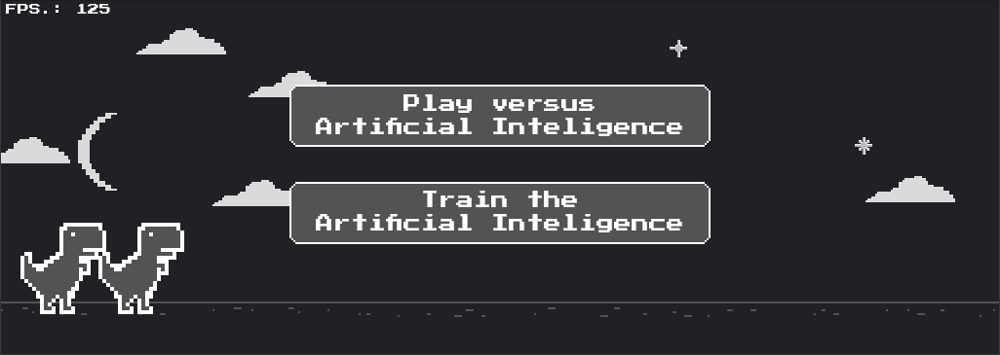

# Dinosaur Edward Game



Dinosaur Edward Game is a game based on the popular Chrome dinosaur game (T-rex), developed in Java 17, using only Java without any auxiliary libraries. The game is created with the help of Spring Boot to start the system and Lombok to make the code less verbose. Additionally, the game features an artificial intelligence that uses natural selection in a genetic algorithm, allowing you to choose between playing against the network or training it.

## Main Features

- The game is inspired by the Chrome dinosaur game (T-rex).
- Developed in Java 17, using only Java without any auxiliary libraries.
- Uses Spring Boot to start the system.
- Uses Lombok to make the code less verbose.
- The game features an artificial intelligence based on a neural network trained by a genetic algorithm.

## System Requirements

- Java Development Kit (JDK) 17

## How to Run the Game

1. Make sure you have Java 17 installed on your system.
2. Clone this repository to your development environment.
3. Navigate to the root directory of the project.
4. Run the following command in the terminal to compile and execute the game:

```bash
./mvnw clean install
./mvnw spring-boot:run
```

## How to Play

- Use the arrow keys for jumping or crouching to avoid enemies.
- Keep the dinosaur alive for as long as possible.
- For every enemy avoided, your score will increase.

## Game Mode Against the Artificial Intelligence

1. After starting the game, select the "Play versus Artificial Intelligence" option in the main menu.
2. Use the arrow keys to control the dinosaur.
3. Try to avoid enemies and survive for as long as possible.
4. Your score will be displayed in the top right corner.

## Artificial Intelligence Training Mode

1. After starting the game, select the "Train the Artificial Intelligence" option in the main menu.
2. The neural network will undergo a training process using a genetic algorithm.
3. The training progress will be displayed in the top right corner.
4. At the end of the training, the weights of the neural network will be saved for future use.

## Credits

The Dinosaur Edward Game was developed by [Edward](https://github.com/edwarddn).

## Acknowledgements

I would like to express my gratitude to the Chrome browser's dinosaur game project for serving as inspiration. 
I would also like to thank Spring Boot and Lombok for making my life easier.
Lastly, a heartfelt thanks goes to my dear and beloved wife.

## Contribution

Contributions are welcome! If you would like to contribute to the Dinosaur Edward Game, please feel free to submit a pull request.
